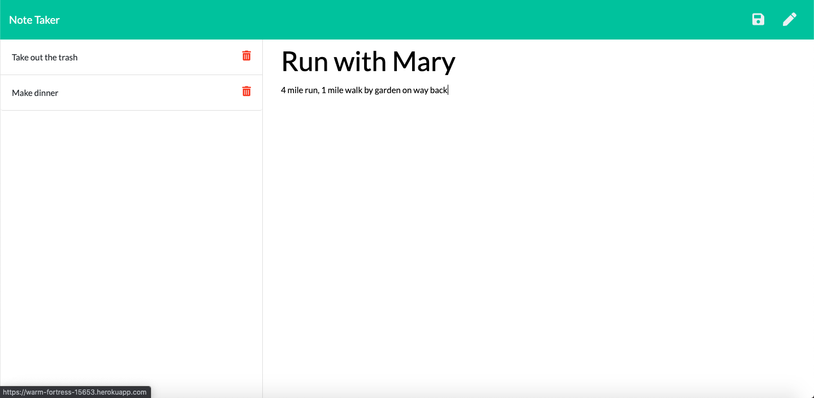
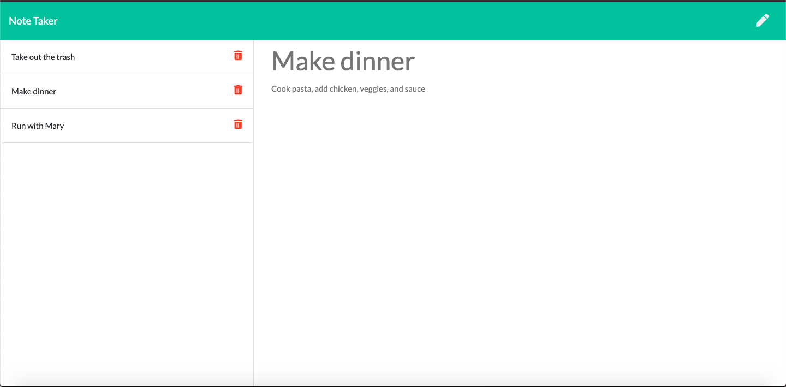
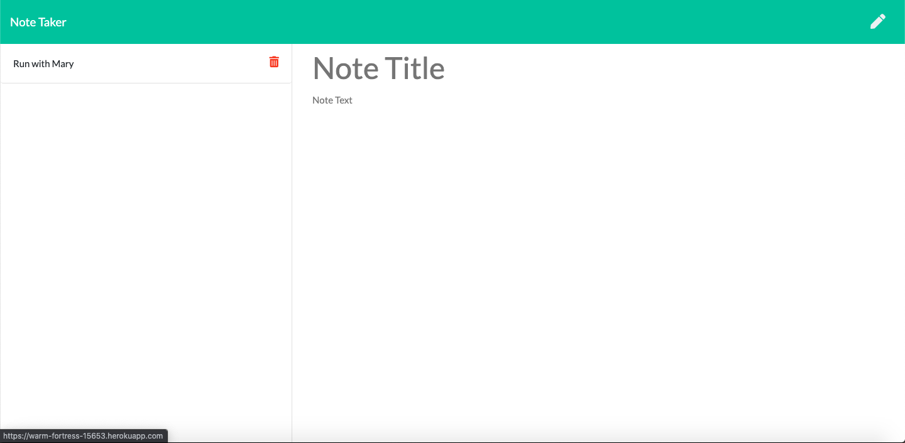

# Note Taker
App that uses an Express server for note-taking that creates a list and allows user to recall and delete data-persistent notes

[](https://opensource.org/licenses/MIT)
  
## Description
Note Taker is a full-stack app that uses JavaScript, node.js, and Express.js to create a data-persistent note-taking platform. JavaScript contains AJAX requests to Express server using GET, POST, and DELETE methods; Express server contains corresponding routes that take in user inputted data, save it to a JSON file, and display or delete it depending on user interaction.

## Table of Contents
* [Installation](#Installation)
* [Usage](#Usage)
* [Images](#Images)
* [Contributing](#Contributing)
* [Credits](#Credits)
* [License](#License)
* [Questions](#Questions)

## Installation
* Clone the repo [here](http://www.github.com/jameygronewald/noteTaker) and run  ```npm install```
* Once you have repo cloned and dependencies installed, run  ```node server.js``` in the command line to start server on localhost:8080.

## Usage
1. View the deployed app [here](https://warm-fortress-15653.herokuapp.com/).
2. Click "Get Started" to navigate to notes page.
3. Type in a title and text in the corresponding fields, and click the save icon in the upper right corner to save a note.
4. Click a note on the note list on the left side of the viewport to view the note, or click the red trashcan icon to delete a note.
5. Click the pencil icon in the upper right corner to write a new note.
6. Refresh the page and your notes remain!

## Images

### Screenshots




## Contributing
I am the sole contributor on this project.

## Credits
Thanks to Georgia Tech Coding Boot Camp for providing outline of project and starter code.

## License
MIT License

Copyright (c) [2020] [Jamey Gronewald]

Permission is hereby granted, free of charge, to any person obtaining a copy
of this software and associated documentation files (the "Software"), to deal
in the Software without restriction, including without limitation the rights
to use, copy, modify, merge, publish, distribute, sublicense, and/or sell
copies of the Software, and to permit persons to whom the Software is
furnished to do so, subject to the following conditions:

The above copyright notice and this permission notice shall be included in all
copies or substantial portions of the Software.

THE SOFTWARE IS PROVIDED "AS IS", WITHOUT WARRANTY OF ANY KIND, EXPRESS OR
IMPLIED, INCLUDING BUT NOT LIMITED TO THE WARRANTIES OF MERCHANTABILITY,
FITNESS FOR A PARTICULAR PURPOSE AND NONINFRINGEMENT. IN NO EVENT SHALL THE
AUTHORS OR COPYRIGHT HOLDERS BE LIABLE FOR ANY CLAIM, DAMAGES OR OTHER
LIABILITY, WHETHER IN AN ACTION OF CONTRACT, TORT OR OTHERWISE, ARISING FROM,
OUT OF OR IN CONNECTION WITH THE SOFTWARE OR THE USE OR OTHER DEALINGS IN THE
SOFTWARE.

## Questions
Please direct any questions to jrgronewald@gmail.com, or visit the GitHub repository at https://github.com/jameygronewald/noteTaker.